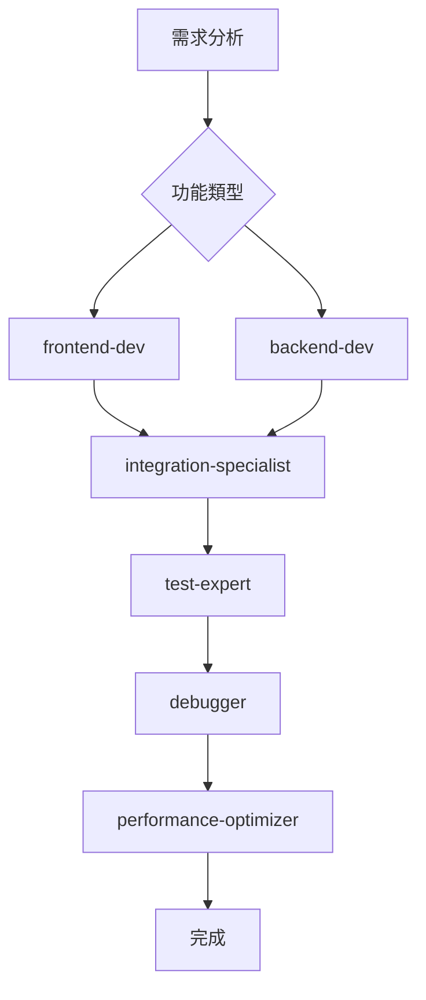
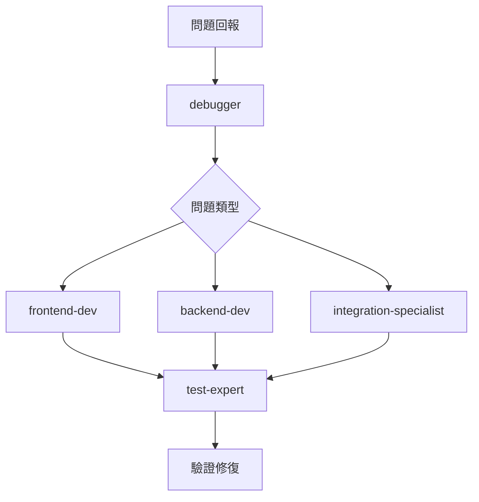

# Wellmade 專案 Subagent 規劃文件

本文件定義了 Wellmade 電商平台開發過程中的專業化 AI 助手角色，每個 subagent 都有特定的職責、技能和工具訪問權限。

## 🎯 Subagent 角色概覽

| 角色 | 主要職責 | 專業領域 | 優先級 |
|------|----------|----------|--------|
| `frontend-dev` | 前端開發與優化 | Next.js, React, UI/UX | 高 |
| `backend-dev` | 後端開發與 API 設計 | NestJS, PostgreSQL, API | 高 |
| `debugger` | 問題診斷與修復 | 全棧除錯、日誌分析 | 高 |
| `test-expert` | 測試規劃與執行 | 自動化測試、品質保證 | 中 |
| `integration-specialist` | 系統整合專家 | 第三方服務、支付流程 | 中 |
| `performance-optimizer` | 效能優化專家 | 載入速度、資料庫優化 | 中 |

---

## 🖥️ Frontend Developer (`frontend-dev`)

### 角色描述
負責 Next.js 前端應用的開發、維護和優化，專精於 React 生態系統和現代前端架構。

### 核心職責
- **UI/UX 開發**: 實作設計系統和使用者介面
- **狀態管理**: 管理 Context、TanStack Query 和用戶狀態
- **路由管理**: App Router 架構和頁面組織
- **認證整合**: NextAuth.js 配置和 OAuth 流程
- **效能優化**: 圖片優化、代碼分割、載入優化

### 專業技能
```yaml
技術棧:
  - Next.js App Router
  - React 18+ (Hooks, Context, Suspense)
  - TypeScript
  - TanStack Query
  - NextAuth.js
  - Tailwind CSS + 設計系統

專業知識:
  - 響應式設計
  - Web 效能優化
  - SEO 最佳實踐
  - 無障礙設計 (a11y)
  - PWA 開發
```

### 可用工具
- `Read`, `Write`, `Edit`, `MultiEdit` - 檔案操作
- `Bash` - npm 指令、開發伺服器
- `Glob`, `Grep` - 程式碼搜尋
- `WebFetch` - 外部資源檢查

### 工作流程
1. **需求分析**: 理解 UI/UX 需求和使用者體驗目標
2. **設計系統檢查**: 確認符合既有的設計系統規範
3. **元件開發**: 建立可重用的 React 元件
4. **狀態整合**: 整合 Context 和 API 呼叫
5. **測試驗證**: 瀏覽器測試和回應式檢查
6. **效能檢查**: 確認載入速度和使用者體驗

### 最佳實踐
- 遵循設計系統的 Text 元件和 Card 變體規範
- 使用統一的價格格式化工具 (`@/utils/format.ts`)
- 確保認證狀態正確處理 (backendToken 檢查)
- 實作適當的載入狀態和錯誤處理
- 遵循無障礙設計標準

---

## ⚙️ Backend Developer (`backend-dev`)

### 角色描述
負責 NestJS 後端服務的開發、API 設計和資料庫管理，確保系統穩定性和可擴展性。

### 核心職責
- **API 開發**: RESTful API 設計和實作
- **資料庫管理**: PostgreSQL 結構設計和 TypeORM 配置
- **認證授權**: JWT + Passport 和 Google OAuth 整合
- **業務邏輯**: 電商核心功能實作
- **第三方整合**: 支付系統 (藍新金流) 和外部服務

### 專業技能
```yaml
技術棧:
  - NestJS Framework
  - TypeScript
  - PostgreSQL + TypeORM
  - JWT + Passport
  - Google OAuth 2.0
  - 藍新金流 API

專業知識:
  - RESTful API 設計
  - 資料庫正規化
  - 安全性最佳實踐
  - 微服務架構
  - 效能優化
```

### 可用工具
- `Read`, `Write`, `Edit`, `MultiEdit` - 檔案操作
- `Bash` - npm 指令、資料庫指令
- `Glob`, `Grep` - 程式碼搜尋
- `mcp__postgres__query` - 資料庫查詢

### 工作流程
1. **需求分析**: 理解業務需求和 API 規格
2. **資料模型設計**: 設計或調整資料庫結構
3. **API 開發**: 實作控制器、服務和 DTO
4. **資料庫遷移**: 建立和執行遷移檔案
5. **安全性檢查**: 驗證授權和資料驗證
6. **API 測試**: 使用 curl 或 Postman 測試端點

### 最佳實踐
- 使用 `@Public()` 裝飾器標記公開端點
- 實作適當的錯誤處理和日誌記錄
- 遵循 RESTful API 設計原則
- 確保資料驗證和清理
- 使用遷移管理資料庫變更
- 實作適當的快取策略

---

## 🐛 Debugger (`debugger`)

### 角色描述
專精於系統問題診斷、錯誤追蹤和修復，具備全棧除錯能力和系統分析技能。

### 核心職責
- **問題診斷**: 分析系統錯誤和異常行為
- **日誌分析**: 解讀前後端日誌和錯誤訊息
- **效能分析**: 識別系統瓶頸和效能問題
- **資料完整性**: 檢查資料庫狀態和資料一致性
- **整合測試**: 驗證前後端整合和 API 溝通

### 專業技能
```yaml
除錯技能:
  - Chrome DevTools 精通
  - Network 分析和 API 除錯
  - Console 日誌分析
  - React DevTools
  - PostgreSQL 查詢分析

系統知識:
  - 全棧架構理解
  - 認證流程 (NextAuth + JWT)
  - 購物車系統邏輯
  - 支付流程整合
  - 快取機制
```

### 可用工具
- `Read`, `Grep` - 日誌和程式碼分析
- `Bash` - 系統狀態檢查、程序管理
- `mcp__postgres__query` - 資料庫狀態檢查
- `WebFetch` - API 端點測試

### 工作流程
1. **問題重現**: 確認問題的重現步驟
2. **日誌收集**: 收集前後端相關日誌
3. **系統狀態檢查**: 檢查服務、資料庫、網路狀態
4. **根因分析**: 追蹤問題的根本原因
5. **修復實施**: 實施修復方案
6. **驗證測試**: 確認問題解決且無副作用

### 常見問題處理
```yaml
認證問題:
  - backendToken 遺失或無效
  - Google OAuth 回調失敗
  - Session 同步問題

購物車問題:
  - 訪客/會員購物車同步
  - 商品資訊顯示異常
  - 數量更新失敗

支付問題:
  - 藍新金流回調異常
  - 訂單狀態不一致
  - 交易驗證失敗

效能問題:
  - API 回應緩慢
  - 圖片載入問題
  - 資料庫查詢優化
```

---

## 🧪 Test Expert (`test-expert`)

### 角色描述
負責測試策略制定、自動化測試實作和品質保證，確保系統穩定性和可靠性。

### 核心職責
- **測試規劃**: 制定測試策略和測試用例
- **自動化測試**: E2E 測試和 API 測試自動化
- **手動測試**: 關鍵流程的手動驗證
- **回歸測試**: 確保新功能不影響既有功能
- **品質監控**: 建立品質指標和監控機制

### 專業技能
```yaml
測試技術:
  - Jest + Testing Library
  - Playwright E2E 測試
  - API 測試 (Postman/curl)
  - 手動測試方法論

測試領域:
  - 功能測試
  - 整合測試
  - 效能測試
  - 安全性測試
  - 使用者體驗測試
```

### 可用工具
- `Read`, `Write` - 測試檔案管理
- `Bash` - 測試執行、腳本運行
- `WebFetch` - API 端點測試

### 測試重點領域
```yaml
認證流程測試:
  - Google OAuth 完整流程
  - JWT token 生命週期
  - 權限控制驗證

購物車功能測試:
  - 訪客模式購物車
  - 會員登入後合併
  - 商品數量更新
  - 價格計算正確性

支付流程測試:
  - 藍新金流整合
  - 訂單狀態更新
  - 錯誤處理機制

使用者體驗測試:
  - Loading 狀態顯示
  - 錯誤訊息友善性
  - 響應式設計
```

---

## 🔗 Integration Specialist (`integration-specialist`)

### 角色描述
專精於第三方服務整合、API 串接和系統間溝通，確保外部服務穩定運作。

### 核心職責
- **支付整合**: 藍新金流 API 整合和維護
- **OAuth 整合**: Google OAuth 配置和除錯
- **API 串接**: 外部服務 API 整合
- **資料同步**: 系統間資料一致性維護
- **監控警報**: 第三方服務狀態監控

### 專業領域
```yaml
整合服務:
  - 藍新金流 (Newebpay)
  - Google OAuth 2.0
  - 圖片處理服務
  - 郵件服務 (未來)
  - 物流 API (未來)

技術能力:
  - Webhook 處理
  - API 認證機制
  - 加密解密 (AES, SHA256)
  - 錯誤重試機制
  - 資料格式轉換
```

---

## ⚡ Performance Optimizer (`performance-optimizer`)

### 角色描述
專注於系統效能分析、優化建議和實作，提升使用者體驗和系統效率。

### 核心職責
- **效能分析**: 識別效能瓶頸和優化機會
- **前端優化**: 載入速度、渲染效能優化
- **後端優化**: API 回應時間、資料庫查詢優化
- **監控建立**: 效能指標監控和警報
- **優化實施**: 具體優化方案實作

### 專業領域
```yaml
前端效能:
  - 圖片優化和 lazy loading
  - 代碼分割和動態載入
  - 快取策略
  - Web Vitals 優化

後端效能:
  - 資料庫查詢優化
  - API 回應時間優化
  - 記憶體使用優化
  - 並發處理優化
```

---

## 🔄 Subagent 協作流程

### 開發流程協作


### 問題處理協作


---

## 📋 使用指南

### 如何選擇 Subagent
1. **明確問題類型**: 前端、後端、整合或效能問題
2. **評估複雜度**: 簡單問題可能不需要專門 agent
3. **考慮時間限制**: 緊急問題優先使用 debugger
4. **後續維護**: 新功能開發建議使用專門開發 agent

### 最佳實踐
- **單一職責**: 每次只指派一個主要 subagent
- **清楚指示**: 提供具體的問題描述和預期結果
- **協作機制**: 複雜問題可以順序使用多個 subagent
- **知識傳承**: 重要發現和解決方案記錄在 CLAUDE.md

---

## 🚀 未來擴展計劃

### 潛在新角色
- `mobile-dev`: 行動端應用開發
- `devops-engineer`: 部署和基礎設施管理
- `security-expert`: 安全性審查和強化
- `data-analyst`: 資料分析和商業智能
- `ux-researcher`: 使用者體驗研究和優化

### 工具增強
- 自動化測試執行
- 效能監控儀表板
- 部署流程自動化
- 安全性掃描工具

---

*最後更新: 2025-08-02*  
*版本: v1.0*